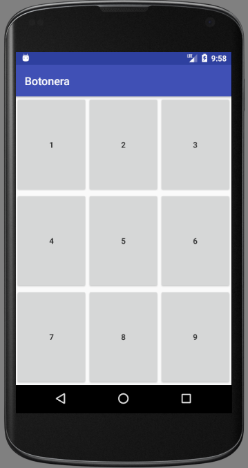

# Botonera de sonidos
Aplicación de ejemplo para el curso de introducción al desarrollo en Android dictado en [Gran Reactor](https://granreactor.comg), en Febrero de 2018.

Coordinador: [Martín Vukovic](https://martin.tttdevs.com)

Es una app simple que muestra una grilla con 9 botones que al ser pulsados reproducen un efecto de sonido.

Esta aplicación se utilizó para ejemplificar el uso de:

- Estructura básica de un proyecto
- LinearLayout
- Button (onClick)
- MediaPlayer